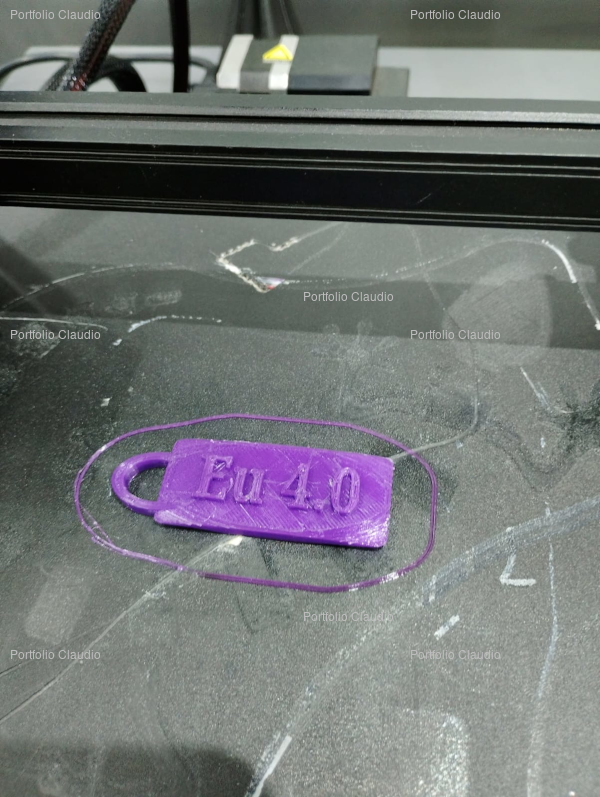

# Manufatura Aditiva

A manufatura aditiva é um processo de criação de objetos tridimensionais por meio da adição de material camada por
camada, frequentemente utilizando técnicas como a impressão 3D.

## Contexto

Permite a criação de objetos a partir de um modelo virtual. Além disto, ela permite a produção de formas complexas que
são difíceis de obter com métodos tradicionais de manufatura.

## Solução

Pontos a destacar na minha solução:

### Casos de Uso

- Agilidade de produção
  - Do modelo virtual diretamente para a peça pronta.
- Redução de custos:
  - Sem a remoção de material da usinagem. Utiliza menos material na produção;
  - Sustentabilidade.

### Projeto e Execução

- Manufatura auxiliada por computador. Projeto no CAD, visualização em 3D. Ao final, o produto impresso em uma
  impressora 3D:

 \
 \
 \
 \

- A partir de agora podemos prototipar rapidamente e/ou desenvolver produtos úteis usando a tecnologia:

