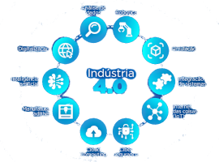

# Indústria 4.0

A quarta revolução industrial tem como foco a **Integração** e **Conectividade**; em transformar os dados existentes em
conhecimento para os gestor através do uso diferentes áreas do conhecimento no processo fabril, desde a impressão 3D à
integração de profissionais de TI e o uso de computação em nuvem.

A Indústria 4.0 cria fábricas inteligentes, conectadas e altamente automatizadas. As tecnologias chave (pilares) da
indústria 4.0 são:

|                                                     | Descrição                                                                                                                                      |
| --------------------------------------------------- | ---------------------------------------------------------------------------------------------------------------------------------------------- |
| **Internet das Coisas (IoT)**                       | Conecta dispositivos e sensores para coletar e analisar dados em tempo real, permite monitoramento e controle remoto dos processos produtivos. |
| **Big Data e Análise de Dados**                     | Utiliza grandes volumes de dados para identificar padrões, otimizar operações e prever falhas.                                                 |
| **Inteligência Artificial (IA) e Machine Learning** | Automatizam processos e otimizam a produção ao aprender com dados históricos.                                                                  |
| **Robótica Avançada**                               | Implementa robôs colaborativos e autônomos que realizam tarefas complexas com precisão e eficiência.                                           |
| **Simulação e Digital Twins**                       | Cria modelos virtuais de processos e produtos para simulação e testes.                                                                         |
| **Manufatura Aditiva (Impressão 3D)**               | Permite a produção de peças e componentes diretamente a partir de modelos digitais.                                                            |
| **Realidade Aumentada e Virtual**                   | Melhora o treinamento, o suporte técnico e a visualização de processos por meio de interfaces imersivas e interativas.                         |

[![Licença][shieldLicense]](LICENSE.txt)

## Índice

1. [Sobre Este Projeto](#sobre-este-projeto)
   1. [Realidade Aumentada](Realidade%20Aumentada/README.md)
2. [Sobre Mim](#sobre-mim)
3. [Agradecimentos e Contato](#agradecimentos-e-contato)
4. [Licença](#licença)

## Sobre Este Projeto

Este repositório tem como objetivo demonstrar meus conhecimento e experiência na área de TI aplicados na indústria. Para
tanto, irei criar demos/POCs de código e ferramentas.

(<a href="#header">voltar ao topo</a>)

## Sobre Mim

Sou pós graduado em Engenharia de Software, moro no Vale do Paraíba e tenho duas certificações Azure:

- Microsoft Certified: Azure Fundamentals
- Microsoft Certified: Azure Data Fundamentals

Além disto, concluí, no Instituto Federal de São Paulo (IFSP), a academia AWS:

(<a href="#header">voltar ao topo</a>)

## Agradecimentos e Contato

Nós temos orgulho de ser _Powered by Open Source Community_:

- Fale conosco [via Discussion](https://github.com/portfolio-2026br/industria-4.0/discussions):\
  

(<a href="#header">voltar ao topo</a>)

## Licença

GNU General Public License v2.0.

(<a href="#header">voltar ao topo</a>)

<!-- markdownlint-enable MD033 -->

[shieldLicense]: https://img.shields.io/badge/License-GPL%20v2-blue.svg?label=Licen%C3%A7a
